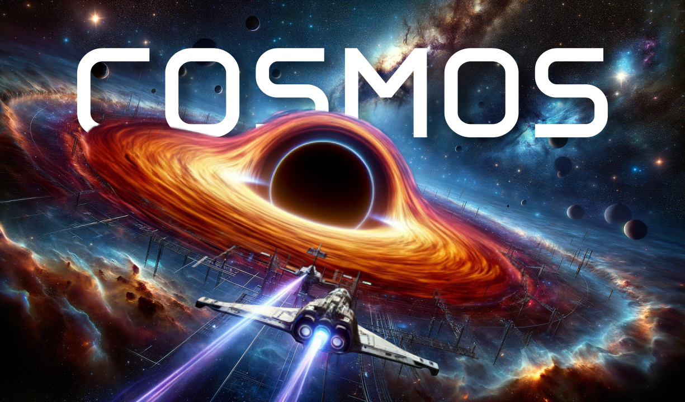

# COSMOS 
#### Code through the stars
___



Step into the cosmos and unleash the power of the universe with the aesthetic syntax of Cosmos, a dynamically-tpyed programming language inspired by the mysteries of space and the thrill of interstellar exploration. Built for creators who dream of coding among the stars, Cosmos transforms every line of code into an adventure across the vast expanse of the galaxy.

#### Features
- User friendly Syntax 
- Dynamically Typed 
- Assignemnt, Arithmetic, Logical Operations 
- Control Flows 
- Loops 
- Functions 
- Closures 
- Classes & Inheritance 
- Handling Escape Sequence 
- Postfix and prefix expressions 
- Lists and Indexed access 
- Interactive REPL

#### Syntax 
__Variable Declaration__  `atom`
``` cpp
// atom is used for declaring variables.
atom x = "Hello world";
```

__Print Statement__ `flare (print)`
``` cpp
// flare is used to print expressions.
flare(3+5); //prints 8
```

__Lists__  
``` cpp
// atom is used for declaring lists.
atom my_lst = [3, 2, 4, 9];
flare(my_lst[2])    // prints 4 
```


__Control Flows__ `probe (if)` `elprobe (else if)` `blackhole (else)`
```cpp
// probe checks for conditions & if it doesn't hold it fall into a blackhole
probe (x==5) {
    // if block 
    flare("correct");
} elprobe (x>5) {
    // else if block 
    flare("partial");
} blackhole {
    // else block 
    flare("fail");
}
```

__Loops__ `navigate (for)` `orbit (while)` `eject (break)` `warp (continue)`
```cpp
// 'navigate' used for 'for' loops (as if navigating through space)
// 'orbit' used for 'while' loops (idea of continually going around a condition)
// 'eject' to 'break' free from loops.
// 'warp' to skip over obstacles and 'continue' forward.

navigate(atom i=0; i<10; i++){ // for loop 
    probe(i%2 == 0){
        warp; // continue
    }
    flare(i);
}

atom i = 10;
orbit(i>0){    // while loop 
    probe(i == 2){
        eject; // break
    }
    flare(i*2);
    i--;
}
```


__Functions__ `mission (to init a function)` `transmit (return)`
```cpp
mission fib(n) {                        // function declaration 
  probe (n < 2) transmit (n);
  transmit (fib(n - 2) + fib(n - 1));   // return: send data back 
}
```

__Closures__
```cpp

mission makeGreeter(greeting)  {
    mission greeter(name)  {
        atom say = greeting + " " + name;
        flare(say);
    }

    transmit (greeter);
}


atom hello = makeGreeter("Hare"); 
atom terve = makeGreeter("Galactic"); 

hello("Krishna");   // Prints: Hare Krishna
terve("Euphoria");  // Prints: Galactic Euphoria
```


#### Setup Instructions 
Dependecies:
* C++20 standard compatible compiler (gcc tested) 
* CMake >= 3.16

You can simply build with CMake:
Clone the repo and navigate to it.

```cmake
# Creates a build dir for the cmake files
cmake -B build -S .
cmake --build build
```

To execute a source file __(.csm extension)__, following is the command:
```cmake
build/src/main <filename>
```

Thanks for visiting! Do give a star, if you like my work 😉


#### Author
- Github - [vansh2308](https://github.com/vansh2308)
- Website - [Vansh Agarwal](https://portfolio-website-self-xi.vercel.app/)


